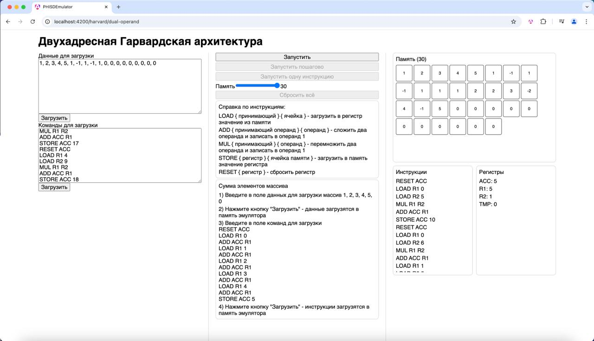

# Эмулятор ассемблера



## Двухадресная Гарвардская архитектура

### Тест

#### Сложение:

1) Загрузить массив чисел `1, 2, 3, 4, 5, 0, 0, 0, 0, 0` в поле данных
2) Загрузить код ассемблера
```asm
RESET ACC
LOAD R1 0
ADD ACC R1
LOAD R1 1
ADD ACC R1
LOAD R1 2
ADD ACC R1
LOAD R1 3
ADD ACC R1
LOAD R1 4
ADD ACC R1
STORE ACC 5
```
3) В шестой ячейке памяти должен появится результат суммирования 5 элементов (15)

#### Свертка двух массивов:

1) Загрузить массив чисел по 5 элементов в ряд и запасные ячейки памяти `1, 2, 3, 4, 5, 1, -1, 1, -1, 1, 0, 0, 0, 0, 0, 0, 0, 0, 0`
2) Загрузить код ассемблера
```asm
RESET ACC
LOAD R1 0
LOAD R2 5
MUL R1 R2
ADD ACC R1
STORE ACC 10
RESET ACC
LOAD R1 0
LOAD R2 6
MUL R1 R2
ADD ACC R1
LOAD R1 1
LOAD R2 5
MUL R1 R2
ADD ACC R1
STORE ACC 11
RESET ACC
LOAD R1 0
LOAD R2 7
MUL R1 R2
ADD ACC R1
LOAD R1 1
LOAD R2 6
MUL R1 R2
ADD ACC R1
LOAD R1 2
LOAD R2 5
MUL R1 R2
ADD ACC R1
STORE ACC 12
RESET ACC
LOAD R1 0
LOAD R2 8
MUL R1 R2
ADD ACC R1
LOAD R1 1
LOAD R2 7
MUL R1 R2
ADD ACC R1
LOAD R1 2
LOAD R2 6
MUL R1 R2
ADD ACC R1
LOAD R1 3
LOAD R2 5
MUL R1 R2
ADD ACC R1
STORE ACC 13
RESET ACC
LOAD R1 0
LOAD R2 9
MUL R1 R2
ADD ACC R1
LOAD R1 1
LOAD R2 8
MUL R1 R2
ADD ACC R1
LOAD R1 2
LOAD R2 7
MUL R1 R2
ADD ACC R1
LOAD R1 3
LOAD R2 6
MUL R1 R2
ADD ACC R1
LOAD R1 4
LOAD R2 5
MUL R1 R2
ADD ACC R1
STORE ACC 14
RESET ACC
LOAD R1 1
LOAD R2 9
MUL R1 R2
ADD ACC R1
LOAD R1 2
LOAD R2 8
MUL R1 R2
ADD ACC R1
LOAD R1 3
LOAD R2 7
MUL R1 R2
ADD ACC R1
LOAD R1 4
LOAD R2 6
MUL R1 R2
ADD ACC R1
STORE ACC 15
RESET ACC
LOAD R1 2
LOAD R2 9
MUL R1 R2
ADD ACC R1
LOAD R1 3
LOAD R2 8
MUL R1 R2
ADD ACC R1
LOAD R1 4
LOAD R2 7
MUL R1 R2
ADD ACC R1
STORE ACC 16
RESET ACC
LOAD R1 3
LOAD R2 9
MUL R1 R2
ADD ACC R1
LOAD R1 4
LOAD R2 8
MUL R1 R2
ADD ACC R1
STORE ACC 17
RESET ACC
LOAD R1 4
LOAD R2 9
MUL R1 R2
ADD ACC R1
STORE ACC 18
```
3) В ячейках 10-17 должен появиться результат свертки: `1, 1, 2, 2, 3, -2, 4, -1, 5`
